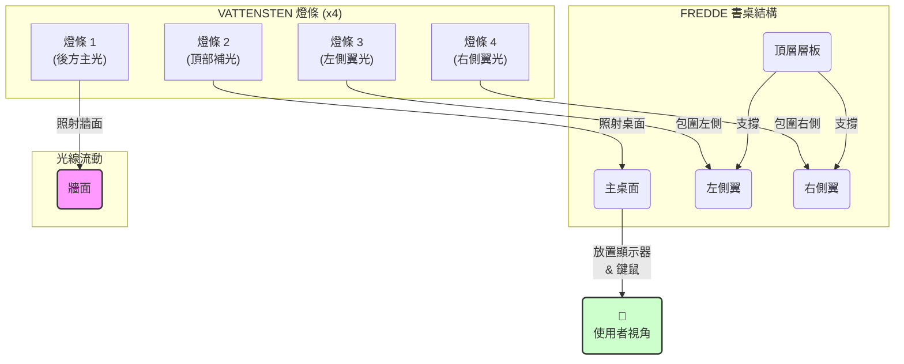

# 方案一：沉浸式氛圍方案 (Immersive Atmosphere)

---

## 1. 設計理念

此方案旨在為使用者創造一個最具包覆感與沉浸感的環境。透過將光線從多個角度（後方、上方、兩側）投射到牆面與桌面，形成一個柔和的光暈籠罩使用者的主要視野區域。其核心目的是在進行遊戲、觀看電影或享受音樂時，將螢幕內的虛擬世界氛圍延伸到實體空間，大幅提升體驗的投入感。

---

## 2. 佈置方式與示意圖

我們將使用四條 VATTENSTEN LED 燈條，並依照以下方式安裝在 FREDDE 書桌上：

*   **燈條 1 (後方主光)**：安裝在**主桌面後側邊緣**，朝上照射後方牆面，製造出寬廣的背景光。
*   **燈條 2 (頂部補光)**：安裝在**頂層層板的下方**，朝下照射，為顯示器後方及桌面提供柔和的頂部補光。
*   **燈條 3 & 4 (兩側翼光)**：分別安裝在書桌**左右兩側的內側面板上**，朝向使用者略偏後方的角度，補足側翼光線，形成完整的環繞感。

### Mermaid 示意圖

---

## 3. 優缺點分析

### ✅ 優點

*   **極致沉浸感**：光線從四個方向包圍使用者，能有效將視覺體驗從螢幕延伸至周遭環境，特別適合劇情豐富的遊戲和電影。
*   **降低視覺疲勞**：透過在視野主要區域外提供柔和的間接光源，可有效降低長時間注視高亮度螢幕所引起的眼睛壓力。
*   **氛圍營造力強**：可輕易透過燈光顏色（若搭配控制器）變換整個空間的氛圍，從激烈的戰鬥到寧靜的探索都能完美匹配。
*   **美學效果佳**：燈光能突顯 FREDDE 書桌獨特的框架結構，讓整個設備看起來更具科技感與未來感。

### ❌ 缺點

*   **可能分散注意力**：對於需要高度專注的文書工作或程式編寫，環繞的動態光效可能會成為干擾源。
*   **螢幕反光風險**：若顯示器為鏡面螢幕，或燈條安裝角度不當，來自側面的光線可能在螢幕上產生些微反光。
*   **佈線稍嫌複雜**：四條燈條的電源線與控制器需要妥善規劃與整理，才能維持桌面的整潔。

---

## 4. 適用情境

*   **3A 遊戲大作**：遊玩《電馭叛客 2077》、《碧血狂殺 2》等具有強烈世界觀與藝術風格的遊戲。
*   **電影與追劇之夜**：觀看科幻片、動作片或任何強調視覺效果的影視作品。
*   **音樂聆聽**：搭配視覺化效果的音樂播放器，享受聲光同步的體驗。
*   **直播背景**：可作為一個動感十足、引人注目的直播主背景。